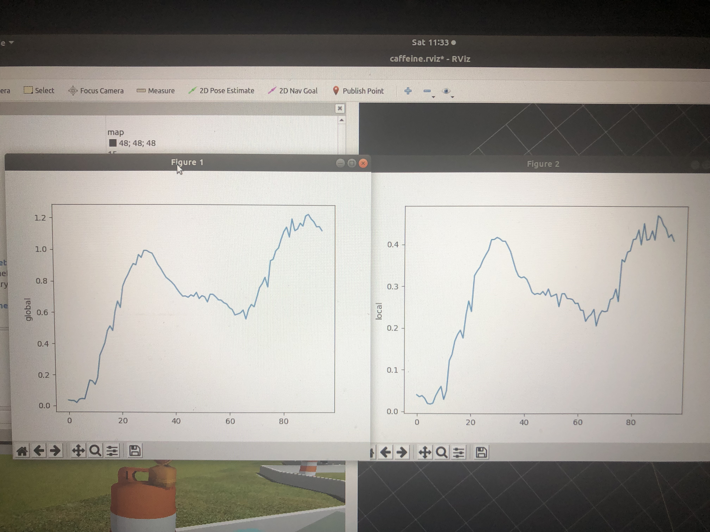

<figure>

<figcaption>

[Photo from Source \[1\]](https://marcmorcos.wordpress.com/references/) This is a previous rover from the same club, current rover is still in production at time of writing

</figcaption>

</figure>

As a member of the Autonomous Rover Team within the University of Toronto Robotics Association, I actively contributed to the development of the operating system, utilizing the Robot Operating System (ROS). This collaborative effort required proficiency in various programming languages, including Python, XML, and C++. My responsibilities spanned sensor calibration, GPS goal setting, and bug tracking, enhancing my skills in both hardware integration and software development.

**Key Contributions:**

1. **Sensor Calibration:**
    - Led the calibration efforts for lidar and camera sensors on the autonomous rover, determining optimal settings for different ranges.
    
    - Strategically defined the sensor focus to optimize data collection and decision-making capabilities.

3. **GPS Goal Setting:**
    - Played a pivotal role in designing and implementing the code responsible for setting GPS goals for the rover.
    
    - Contributed to enhancing the rover's navigation capabilities by fine-tuning the interaction between the software and GPS positioning.

5. **Bug Tracking Scripts:**
    - Developed scripts to identify and troubleshoot bugs in the GPS position estimates, streamlining the debugging process.
    
    - Demonstrated problem-solving skills in ensuring accurate and reliable GPS data for the autonomous rover.

**ROS Proficiency and Career Implications:**

- **ROS Basics:**
    - Acquired fundamental knowledge of Robot Operating System (ROS), a critical skill in the field of robotics.
    
    - The hands-on experience with ROS is particularly valuable as it is widely adopted in the industry, with many companies relying on similar software.

- **Industry Relevance:**
    - Recognized the importance of ROS in the robotics industry, with many companies incorporating it into their development processes.
    
    - The skills gained in working with ROS position me as a competitive candidate for roles in robotics software development.

**Learning and Career Growth:**

- **Multilingual Programming:**
    - Expanded proficiency in multiple programming languages, including Python, XML, and C++, showcasing adaptability to diverse coding environments.
    
    - Gained a holistic understanding of the software stack used in robotics, contributing to versatile problem-solving abilities.

- **Real-World Application:**
    - Translated theoretical knowledge into practical application by actively contributing to the development of an autonomous rover.
    
    - The experience offered insight into the challenges and intricacies of developing robotics systems for real-world scenarios.

**Conclusion:**

Being a part of the Autonomous Rover Team at the University of Toronto Robotics Association was not just an extracurricular engagement; it was a hands-on exploration of cutting-edge technologies in the field of robotics. From sensor calibration to GPS goal setting, my contributions to the operating system of the autonomous rover enhanced my skills in ROS and positioned me for a successful career in robotics software development. This experience serves as a testament to the importance of practical, industry-relevant skills acquired through active involvement in robotics projects.

<figure>

<figcaption>

Graphs generated by my GPS debugging script

</figcaption>

</figure>
